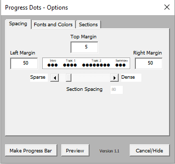
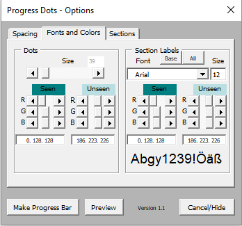
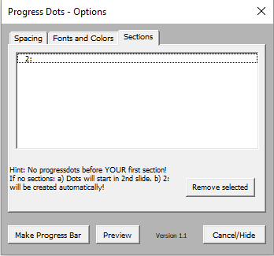

Progress Dots
=============
This macro adds a toolbar to PowerPoint that can be used to create a "progress bar" for your presentation.  A series of dots is drawn across the top border, corresponding to slides; and these dots change color as you advance through the presentation.  The dots can be grouped into "sections," to indicate the overall structure of your talk.

Installing
----------
To install progress dots:

- Open PowerPoint
- Under the "Tools" menu, select "Add-Ins"
- Click "Add New"
- Select the file "progress_dots.ppa"
- Click "Enable Macros"

To uninstall progress dots:

- Open PowerPoint
- Under the "Tools" menu, select "Add-Ins"
- Select the "progress_dots" add-in
- Click "Remove"

Toolbar
-------
When the Progress Dots macro is run, it adds a new toolbar to PowerPoint.
The toolbar includes four buttons:

- **Create:** opens an options dialogue to customize the progress bar;
  and then draws the progress bar on each slide.  (This can be slow
  for large powerpoint presentations.)

  * _Spacing:_ Easily adjust the left, right and top margin of the dots. I added a slider to change the spacing between sections in an easy way. Next to the slider a value is show, so that you are able to replicate the settings later again.
  

  * _Fonts and Colors_:  A slider for the dot size (with a text value for later reproduction). On the left and right, you can change the colors of the (un)seen dots now easily and you get direct visual feedback: The corresponding labels are colored accordingly. Further, you can use a button to either load base fonts or all fonts installed on your machine. A preview of the font is shown.
  

  * _Sections_: Remove sections by simply selecting those and clicking the remove button!
  

- **Refresh:** redraws the progress bar.  You will need to use this
  after adding or removing slides, or section labels.

- **Delete:** removes the progress bar from each slide.

- **Section:** adds a section label to the current slide.  All slides
  from the current slide to the next slide that you asssign a
  section label to are considered to be part of the same section,
  and will be displayed in a group.  E.g., in the example above,
  four slides are marked with section labels: the first is marked
  with "Intro," the fifth with "Topic 1," the ninth with "Topic 2,"
  and the eighteenth with "Conclusions."

Editing
-------
If you'd like to edit the macro, to make your own customizations to
it:

- Open the file "progress_dots.ppt"
- Under the "Macros" submenu of the "Tools" menu, slect "Visual Basic
  Editor"

History
------
This macro was originally written by Ed Loper and available
 [here](http://ed.loper.org/projects/progress_dots/) with extensive edits by Olaf Nöhring, http://www.datenbank-projekt.de
